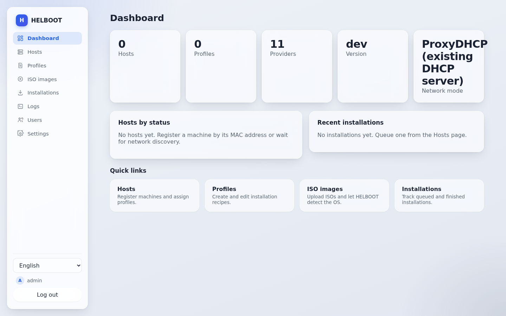
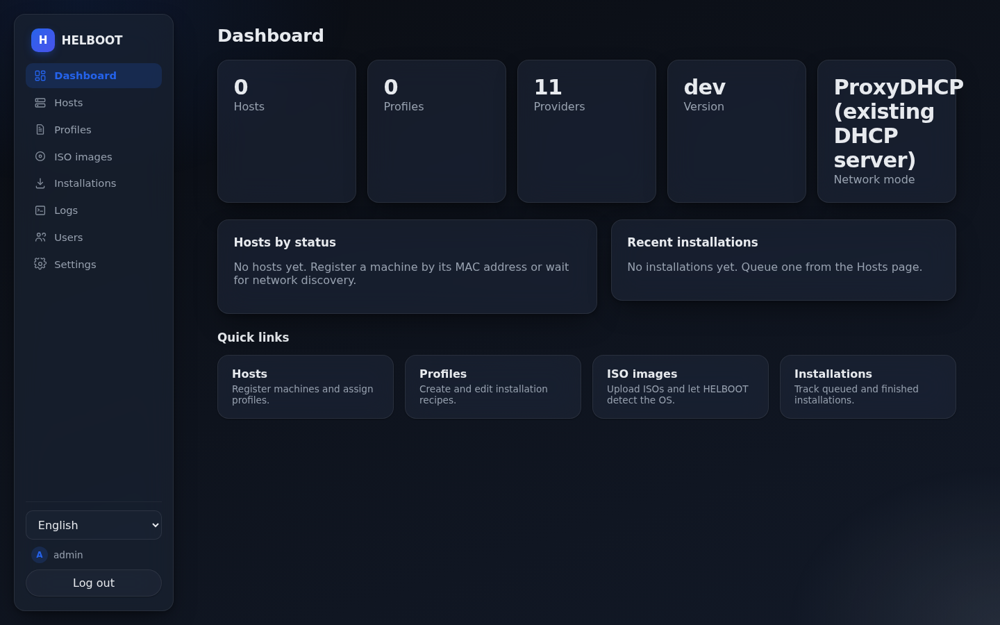
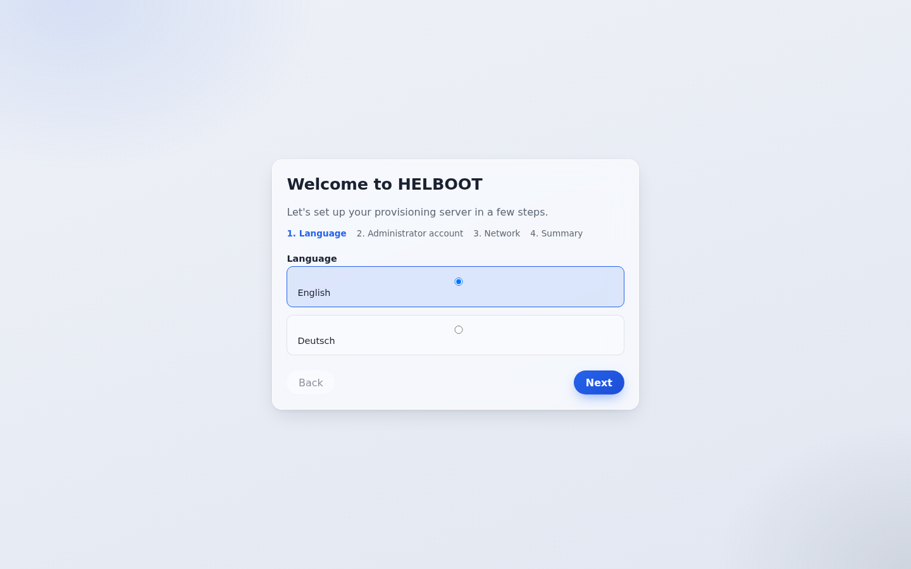
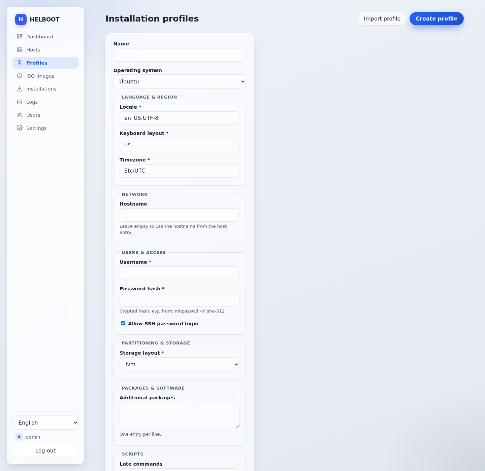

<h1 align="center">HELBOOT</h1>

<p align="center">
  <strong>Provisioning engine for homelabs — unattended OS installs over the network</strong>
</p>

<p align="center">
  
  
  
  
</p>

---

HELBOOT is a provisioning engine for homelabs. Upload an original OS ISO, let
HELBOOT detect what it is, create an installation profile, register your
machines by MAC address, assign a profile — and get fully automated,
unattended OS installations over the network.

PXE is just one boot method. The architecture is built to grow: iPXE,
HTTP boot, USB boot images, VM provisioning, cloud-init, Redfish and IPMI
are all part of the roadmap.

> ✅ **Status:** **v1.0.0 is live** — image published on GHCR
> (`:latest` / `:1.0.0`). Implemented: the full network boot chain
> (ProxyDHCP/DHCP, TFTP, iPXE scripts, answer files), ISO management
> with automatic OS detection, the installation queue, host discovery,
> user management with roles, backup/restore, a log viewer and USB/CD
> boot media — all behind a bilingual (en/de) web UI. Still a young
> project; see [SECURITY.md](SECURITY.md) for the threat model,
> [CHANGELOG.md](CHANGELOG.md) for release notes, and
> [ARCHITECTURE.md](docs/ARCHITECTURE.md) / the [ADRs](docs/adr/) for
> the design.

---

## Screenshots

<p align="center">
  
  
</p>
<p align="center"><em>Dashboard overview — light and dark</em></p>

<p align="center">
  
  
</p>
<p align="center"><em>First-run setup wizard, and a profile form generated entirely from the provider's settings schema — no hardcoded per-OS forms</em></p>

---

## Why HELBOOT?

Existing netboot tools either serve live images only, require deep manual
configuration, or are built for enterprise fleets. HELBOOT targets the
homelab: one Docker container, a first-run wizard, original (unmodified)
ISOs, and profiles that generate the unattended-install answer files for
you.

---

## Core concepts

| Concept | What it is |
| ------- | ---------- |
| **Provider** | A pluggable module describing one operating system: its boot methods, install methods, required files and answer-file templates. No OS logic is hardcoded. |
| **Capability** | A declarative description of what a provider supports (`pxe`, `http_boot`, `unattended_install`, `secure_boot`, …). The UI adapts automatically. |
| **Profile** | A versioned installation recipe: OS + ISO + language, users, network, partitioning, packages, scripts. |
| **Host** | A machine registered by MAC address, with vendor, model, tags, assigned profile and installation history. |
| **Queue** | Planned installations with status tracking: discovered → waiting → installing → success/error. |

---

## Supported operating systems

- **Windows:** 10, 11, Server 2022, Server 2025
- **Linux:** Debian, Ubuntu, Fedora, openSUSE
- **Virtualization:** Proxmox VE, VMware ESXi
- **NAS:** TrueNAS SCALE

Where full automation is not technically possible for an OS, the provider
documents its limitations and the UI reflects them via capabilities — for
example TrueNAS SCALE network-boots its installer but has no unattended
answer-file format of its own.

HELBOOT only ships providers it can install fully unattended over the
network (or, like TrueNAS SCALE, at least network-boot). Operating
systems that ship as pre-built disk images with no network-install path
of their own (e.g. DietPi, Home Assistant OS) are out of scope until
HELBOOT gains a network image-write capability — see the
[provider request template](.github/ISSUE_TEMPLATE/provider_request.yml)
if you'd like to help design that.

---

## Network modes

- **Mode A — existing DHCP** (e.g. a FRITZ!Box): HELBOOT runs ProxyDHCP,
  PXE/iPXE, TFTP and HTTP boot alongside your router. No changes to your
  network required.
- **Mode B — HELBOOT DHCP:** HELBOOT provides DHCP itself, plus PXE, TFTP
  and HTTP.

---

## Deployment

One Docker image, one container. Host networking is the recommended mode
(required for DHCP/ProxyDHCP broadcast traffic). See
[DOCKER.md](docs/DOCKER.md) and [UNRAID.md](docs/UNRAID.md) for details,
including the Unraid Community Applications template.

```bash
docker run -d \
  --name helboot \
  --network host \
  -v /path/to/data:/data \
  -v /path/to/isos:/data/isos \
  ghcr.io/kreuzbube88/helboot:latest
```

Pin an explicit version instead of `:latest` (e.g. `:1.0.0`) if you
prefer controlled, deliberate upgrades — see
[CHANGELOG.md](CHANGELOG.md) for what changed between releases.

On first start, the web UI walks you through a setup wizard: language,
admin account, network mode, storage locations, and optionally your first
ISO and profile.

---

## Tech stack

- **Backend:** Go — single static binary, REST API with OpenAPI spec
- **Frontend:** React + TypeScript, fully internationalized (English and German)
- **Database:** SQLite with migrations, backup and restore
- **Auth:** Local users (Argon2id) with roles (Administrator, Operator, Viewer); OIDC-ready

See the [Architecture Decision Records](docs/adr/) for the reasoning
behind each choice.

---

## Documentation

- [Changelog](CHANGELOG.md)
- [Architecture](docs/ARCHITECTURE.md)
- [Development guide](docs/DEVELOPMENT.md)
- [API](docs/API.md)
- [Docker deployment](docs/DOCKER.md)
- [Unraid](docs/UNRAID.md)
- [Security policy](SECURITY.md)
- [Contributing](CONTRIBUTING.md)

---

## License

HELBOOT is licensed under the [GNU Affero General Public License v3.0](LICENSE).
